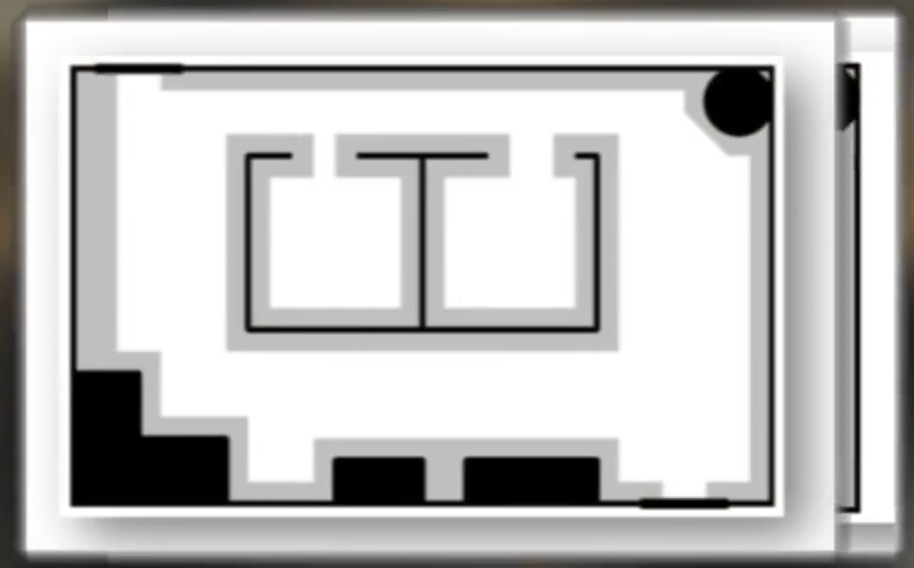
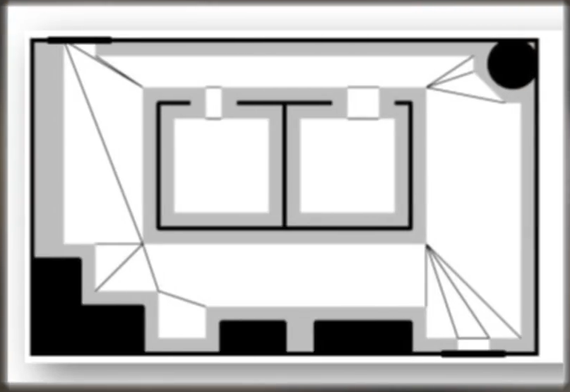
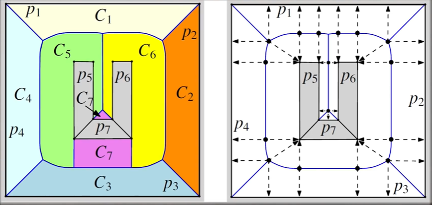
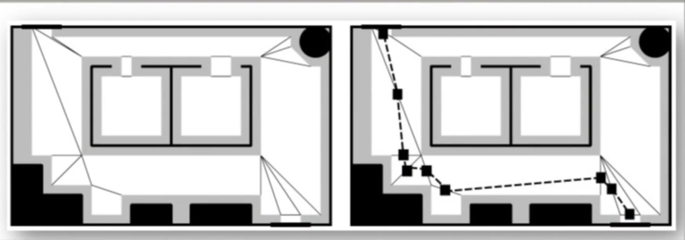

# Navigation Mesh

## 基础介绍

https://www.youtube.com/watch?v=U5MTIh_KyBc&list=PLokhY9fbx05eeUZCNUbelL-b0TyVizPjt&index=6

导航网格是一种数据结构，过将表面或空间编码为一系列多边形，来表示表面或空间的可访问性。

游戏中AI在给定的表面上移动，很可能是使用了导航网格。

**导航网格存储着一些关于AI如何在空间中移动的重要数据，例如：
1、哪些表面是可以访问的。
2、各个表面是如何与其他表面链接的。
3、将这些表面划分为特定的类型或区域，穿越不同区域会有不同的成本，也可以告诉AI它们现在正处于什么类型的区域。**

对空间的可访问性进行建模对于实现任何类型的智能运动都是至关重要的，**因为这种易于计算的方式可以让我们确保我们的角色知道它是否可以在游戏空间中移动。**

**同时区域的类型很重要，可以让AI看起来更聪明一些**。例如在刺客信条和孤岛惊魂中，AI会极力避免中水中移动，而选择在海岸旁边进行攻击或到处走动。利用成本来控制区域。可以让AI优先做出更符合我们预期的移动，比如GTA中的平民，AI可以沿着人行道走，会使用红绿灯。

链接可以帮助我们管理角色如何穿越导航网格中的间隙。通常我们希望当AI在特定的地点时，会在导航网格之间移动，例如：在《极度恐慌》中，士兵会在楼梯爬上爬下，在DOOM中恶魔会跳上更高的台阶。**链接决定了在何处以及何时发生这些情况，它们通常与动画紧密联系，这些动画在遍历链接时会播放。**

当导航网格出问题时，通常也是最容易被看出来的。

一些早期技术，如：meadow mapping 或 [voronoi tessellation](https://zh.wikipedia.org/wiki/%E6%B2%83%E7%BD%97%E8%AF%BA%E4%BC%8A%E5%9B%BE)
,可以将空间分割成多个多边形，

这是构建导航网格的基石。

空间被分解后，AI就可以使用搜索算法来绘制可以穿过空间的路径，并将路径优化得更加自然。

导航网格通常是在开发过程中预先在引擎中烘培的，作为数据存储在关卡文件中。

